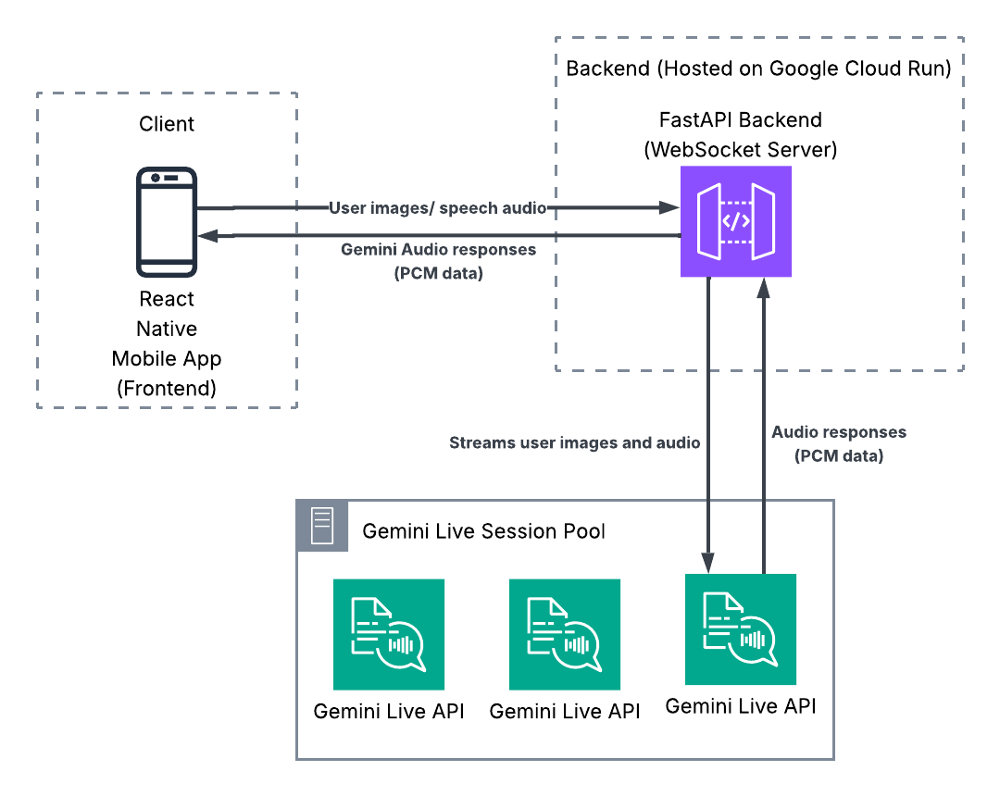

# Shoelace

Shoelace is an accessibility assistant mobile app built with React Native (Expo). It guides users through everyday tasks by capturing camera snapshots, sending them to Google's Gemini Live API, and returning step-by-step audio instructions in real time.


## Running the App

Due to the use of non-expo packages, the app cannot be tested using the traditional method of cloning the repo and using the Expo Go CLI

A pre-built apk of the app is available on https://expo.dev/accounts/mcrowley19/projects/helper-app/builds/b91b46c7-0ae4-4344-9e5e-fcd11edf90f2

## System Architecture



### Frontend

**Stack:** React Native

The frontend is organized as a file-based routed Expo app:

```
frontend/helper-app/
├── app/                     # Expo Router pages
│   ├── _layout.tsx          # Root layout (providers, splash screen)
│   ├── (tabs)/              # Tab navigation
│   │   ├── index.tsx        # Home — task carousel by category
│   │   ├── completed.tsx    # Completed tasks list
│   │   └── settings.tsx     # Transcription toggle
│   └── task/
│       ├── setup/[id].tsx   # Pre-task setup guides
│       └── [id].tsx         # Active task session (camera + audio)
├── components/              # TaskCamera, CompletionOverlay, etc.
├── context/                 # React Context providers
│   ├── tasks-context.tsx    # Global task state (add/update/toggle/delete)
│   └── settings-context.tsx # User prefs, persisted via AsyncStorage
├── data/tasks.ts            # Predefined task library with AI prompts
├── constants/theme.ts       # Colors and fonts
├── styles/                  # StyleSheet definitions
└── utils/                   # Camera, audio, and asset helpers
```

During a session, three hooks collaborate:

- **useTaskSession** — opens a WebSocket to the backend, captures camera frames every 3 seconds as base64 JPEGs, receives PCM audio and transcription chunks, and triggers `CompletionOverlay` on `TASK_COMPLETE`.
- **useAudioSession** — creates a 24 kHz `AudioContext`, decodes incoming PCM base64, queues chunks for playback, and blocks recording while audio is playing.
- **useVoiceInput** — records press-and-hold audio at 16 kHz WAV, encodes to base64, and sends via the WebSocket. Drives the pulsing animation on the mic button.

**State management:** React Context API (no external state library). `TasksContext` holds the task list in memory; `SettingsContext` persists preferences to AsyncStorage.

**Key libraries:** react-native-vision-camera, react-native-audio-api, expo-av, react-native-reanimated, react-native-quick-base64.

### Backend

**Stack:** FastAPI, Google Gemini Live API

```
backend/
├── agent.py      # FastAPI app & WebSocket endpoint
├── session.py    # Gemini Live session management
├── pool.py       # Pre-warmed session pool (default 5 sessions)
├── config.py     # System prompts and configuration
├── utils.py      # Image resizing, audio helpers, WebSocket utilities
├── Pipfile       # Python dependencies
└── Dockerfile
```

The backend maintains a pool of pre-warmed Gemini Live sessions for instant connections. On each WebSocket connection:

1. A pooled session is acquired.
2. The task-specific AI prompt is injected on the first camera frame.
3. Incoming JPEG frames are resized (max 1024 px, quality 80) and forwarded to Gemini.
4. Gemini streams back PCM audio chunks (24 kHz, 16-bit mono) and transcription text.
5. When the AI determines the task is complete, it sends a `TASK_COMPLETE` signal.

### WebSocket Protocol

| Direction       | Type          | Payload                                   |
| --------------- | ------------- | ----------------------------------------- |
| Client → Server | Image frame   | Raw base64 JPEG                           |
| Client → Server | Voice input   | `{ type: "audio", data: "<base64 WAV>" }` |
| Server → Client | Audio         | Binary PCM chunks (24 kHz 16-bit mono)    |
| Server → Client | Transcription | `{ type: "transcription", text: "..." }`  |
| Server → Client | Ready         | `{ type: "ready" }` — request next frame  |
| Server → Client | Complete      | `{ type: "TASK_COMPLETE" }`               |
